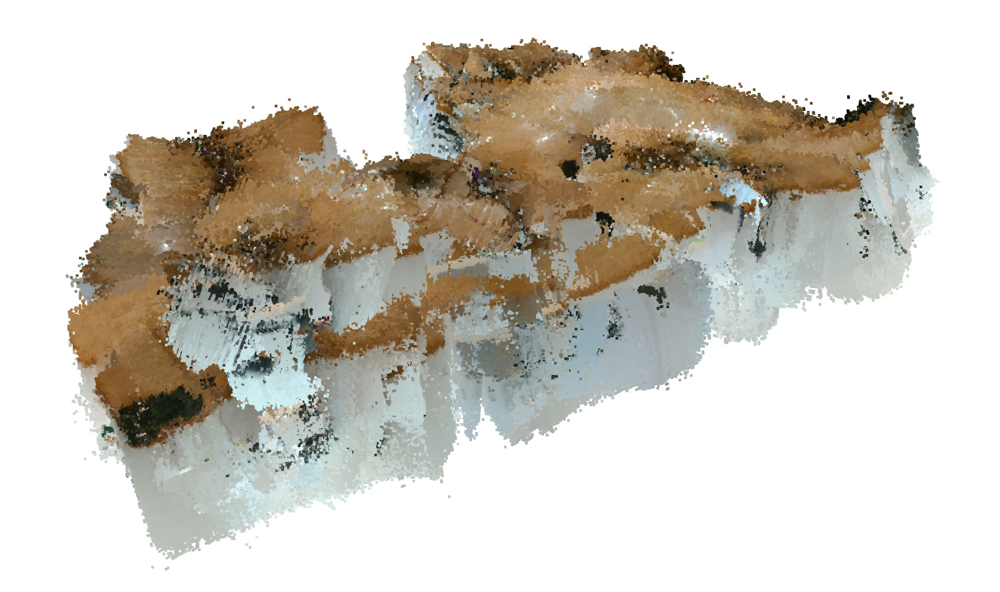
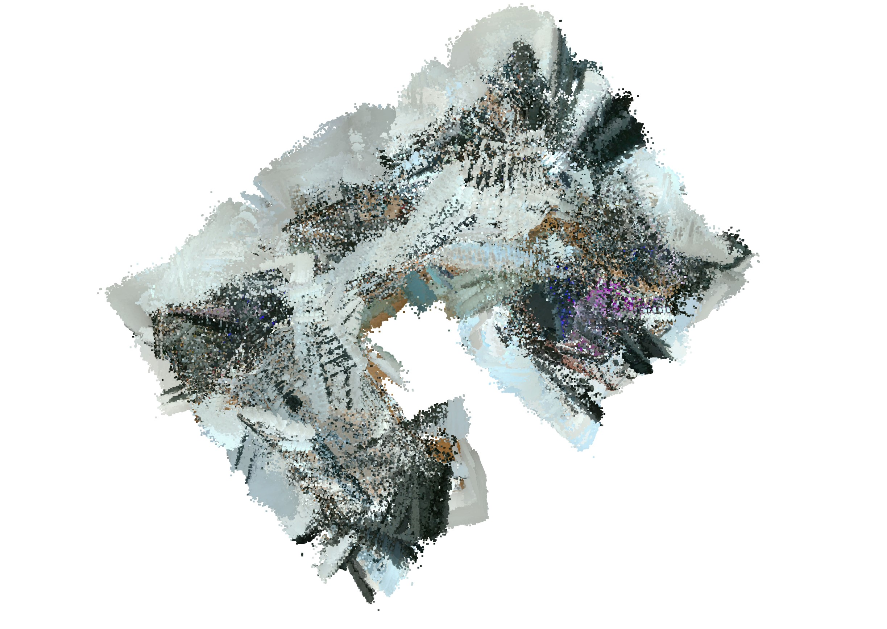
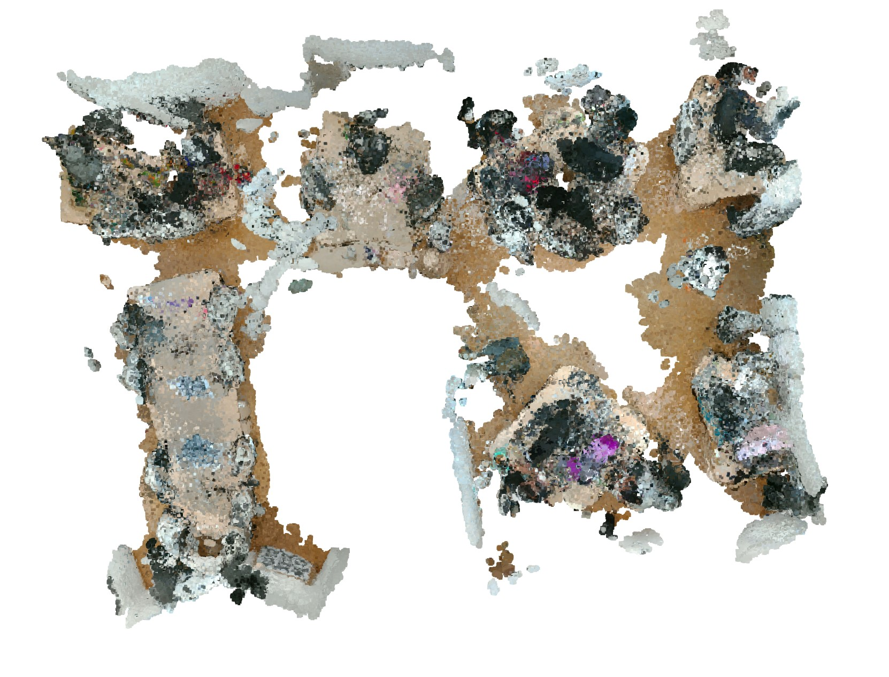

# 3D Point Cloud Processing

This project implements a comprehensive pipeline for processing 3D point cloud data, with a focus on orientation correction, preprocessing, and floor segmentation in indoor environments.

## 📋 Table of Contents
- [Overview](#overview)
- [Features](#features)
- [Requirements](#requirements)
- [Installation](#installation)
- [Usage](#usage)
- [Project Structure](#project-structure)
- [Pipeline Workflow](#pipeline-workflow)
- [Results](#results)


## 🌟 Overview

This project processes 3D point cloud data to:
1. **Correct point cloud orientation** - Align the floor plane horizontally
2. **Preprocess data** - Remove noise, downsample, and filter outliers
3. **Floor segmentation** - Separate floor surface from objects and calculate floor height

## 📸 Visual Results

### Original Scene
<table>
  <tr>
    <td align="center">
      
      <br><b>Raw Scene 1</b>
    </td>
    <td align="center">
      
      <br><b>Raw Scene 2</b>
    </td>
  </tr>
</table>

### After preprocessing
<table>
  <tr>
    <td colspan="3" align="center">
      
      <br><b>Final Filtered Point Cloud</b>
    </td>
  </tr>
</table>

## ✨ Features

- **Orientation correction** using RANSAC plane fitting
- **Multi-stage preprocessing pipeline**:
  - Uniform downsampling
  - Statistical outlier removal
  - Radius-based outlier removal
  - DBSCAN clustering for noise reduction
- **Floor segmentation** based on RANSAC
- **Comprehensive visualization** with Open3D
- **Jupyter notebook interface** for interactive analysis

## 🚀 Installation

### Step-by-Step Installation

#### Option 1: Using Conda (Recommended)

1. **Clone the repository**:
   ```bash
   git clone https://github.com/nhuyha/3D-point-cloud-process.git
   cd 3D-point-cloud-process
   ```

2. **Create conda environment**:
   ```bash
   # Create new environment with Python 3.12.5
   conda create -n pointcloud python=3.12.5
   
   # Activate the environment
   conda activate pointcloud
   ```

3. **Install dependencies**:
   ```bash
   # Install all from requirements.txt
   pip install -r requirements.txt
   ```

#### Option 2: Using Virtual Environment (Python venv)

1. **Clone the repository**:
   ```bash
   git clone https://github.com/nhuyha/3D-point-cloud-process.git
   cd 3D-point-cloud-process
   ```

2. **Create virtual environment**:
   ```bash
   # Windows
   python -m venv pointcloud_env
   pointcloud_env\Scripts\activate
   
   # Linux/MacOS
   python -m venv pointcloud_env
   source pointcloud_env/bin/activate
   ```

3. **Install dependencies**:
   ```bash
   pip install --upgrade pip
   pip install -r requirements.txt
   ```


### 4. **Prepare your data**:
   - Create the `data` folder if it doesn't exist:
     ```bash
     mkdir data
     ```
   - Place your input point cloud file as `data/pointcloud_rgb_gpu.ply`
   - Supported formats: PLY files with RGB color information


## 📖 Usage

### Run Complete Pipeline 

```bash
# Step 1: Correct orientation
python orientation.py

# Step 2: Preprocess the data
python preprocessing.py

# Calculate the height of floor (Z-mean)
python floor_segmentation.py
```


## 📁 Project Structure

```
3D/
├── data/
│   ├── pointcloud_rgb_gpu.ply    # Input RGB point cloud
│   ├── pcd.ply                   # Orientation-corrected point cloud
│   ├── pcd_preprocess.ply        # Preprocessed point cloud
│   └── pcd_filtered.ply          # Final filtered point cloud
├── image/
│   ├── raw_1.jpg                 # Original scene images
│   ├── raw_2.jpg
│   ├── downsampling.jpg          # Processing step visualizations
│   ├── statistic.jpg 
│   ├── radius.jpg 
│   └── filtering.jpg             # Final scene image
├── orientation.py                # Orientation correction module
├── preprocessing.py              # Preprocessing pipeline
├── floor_segmentation.py         # Caculating the floor height(Z-mean)
├── notebook.ipynb               # Notebook
├── requirements.txt             # Python dependencies
└── README.md                   
```

## 🔄 Pipeline Workflow

### 1. Orientation Correction (`orientation.py`)
- **Input**: Raw RGB point cloud (`pointcloud_rgb_gpu.ply`)
- **Process**: 
  - RANSAC plane fitting to detect floor
  - Calculate rotation matrix to align floor with XY-plane
  - Apply rotation transformation
- **Output**: Oriented point cloud (`pcd.ply`)

### 2. Preprocessing (`preprocessing.py`)
- **Input**: Oriented point cloud (`pcd.ply`)
- **Process**:
  - **Downsampling**: Uniform sampling 
  - **Statistical filtering**: Remove outliers
  - **Radius filtering**: Remove sparse points 
  - **Clustering**: DBSCAN clustering 
  - **Size filtering**: Keep only clusters with >100 points
- **Output**: Clean point cloud (`pcd_filtered.ply`)

### 3. Floor Segmentation (`floor_segmentation.py`)
- **Input**: Preprocessed point cloud (`pcd.ply`)
- **Process**: 
  - Robust RANSAC with multiple trials 
  - Select lowest plane as floor surface
  - Calculate floor height (Z-mean)
- **Output**: Floor height value and separated floor/object clouds

## 📊 Results

The pipeline typically achieves:
- **Noise reduction**
- **Processing speed**: Significant improvement through downsampling
- **Orientation accuracy**: Precise floor alignment using RANSAC

## 🛠 Advanced Configuration

### Preprocessing Parameters
- **Downsampling**: Adjust `every_k_points` in `uniform_down_sample()`
- **Statistical filtering**: Tune `nb_neighbors` and `std_ratio`
- **Radius filtering**: Modify `nb_points` and `radius`
- **DBSCAN**: Adjust `eps` and `min_samples` based on point density


